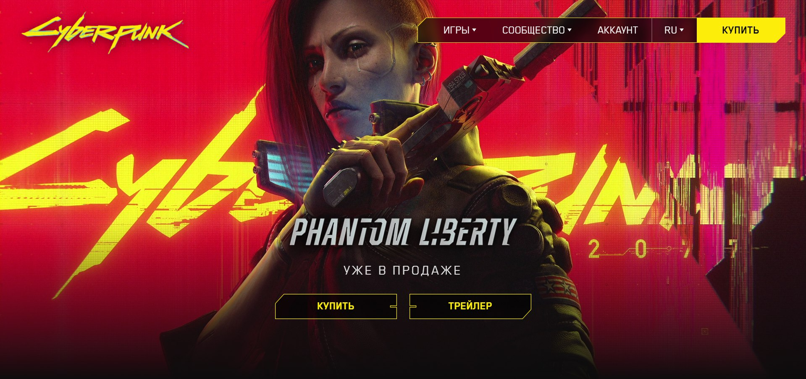

## Used dev language
- HTML/CSS
- JavaScript

## Things done

- Multilingual page
- Responsiv
- Functional buttons
- Alert

## Social Media Account

-<a href="https://t.me/shakxzodbek" style="display: inline-flex; align-items: center; background-color: #0088cc; color: white; padding: 10px 15px; text-decoration: none; border-radius: 5px;">
    Telegram 
</a>
 
-<a href="https://instagram.com/shakxzodbee" style="display: inline-flex; align-items: center; background-color: #0088cc; color: white; padding: 10px 15px; text-decoration: none; border-radius: 5px;">
    Instagram 
</a>
 
-<a href="https://github.com/Shakxzodbee" style="display: inline-flex; align-items: center; background-color: #0088cc; color: white; padding: 10px 15px; text-decoration: none; border-radius: 5px;">
    Github 
</a>
